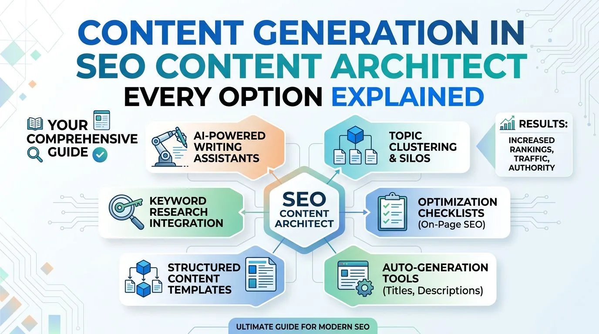
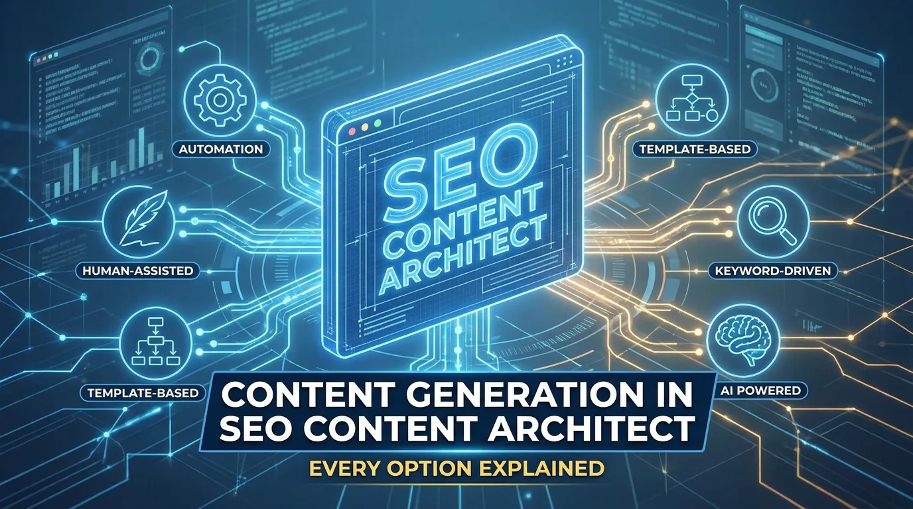

SEO Content Architect gives you three ways to produce an article. Most users discover only the first one, **New Article**, and never look further. That is a missed opportunity, because **Bulk Engine** and **Auto Posting** solve entirely different problems at different scales.

More importantly, every generation setting changes both your output quality and your API bill. You pay your provider directly for each call, so toggling Deep Online Research, High Quality Mode or images per article is a cost decision as much as a quality one. Understanding what each control does is the difference between a cheap cluster and an expensive one with the same final result.

After reading this guide you will know which engine to reach for, what each setting actually changes, and how to move a generated article from raw output to publication-ready in the Studio Editor. Here is the map: **New Article** gives full control over a single piece, **Bulk Engine** runs an unattended list of titles, **Auto Posting** maintains a standing schedule, and **Studio Editor** is where all three land for final refinement.

## Before You Start

- **SEO Content Architect** installed on Windows 10 or 11
- **At least one AI API key** — Google Gemini, OpenAI, Anthropic Claude or OpenRouter. You bring your own key and pay the provider directly ([full cost breakdown here](real-cost-of-ai-generated-articles-byok-vs-saas.md), and [a comparison of the models](gemini-vs-gpt-vs-claude-best-ai-model-for-writing.md) if you are undecided)
- **An OpenRouter key specifically** if you want Deep Online Research, since that runs on Perplexity Sonar
- **A connected WordPress site**, if you intend to publish rather than export ([setup takes about three minutes](publish-first-ai-article-to-wordpress-in-10-minutes.md))

> **Free vs Premium:** article generation, editing and export are unlimited on the free plan. The Bulk Engine, Auto Posting and the SEO tooling in the editor (Content Score, internal links, Search Console data) are Premium features.

## The Shared Generation Core: What Every Article Starts From

All three engines build articles from the same underlying system. Understanding this core once means you can predict what any engine will produce before you spend a credit.

### Topic and Keywords: The Starting Point

The **Topic** field accepts either a keyword phrase or pasted source text, up to 20,000 characters. That dual function means you can paste a competitor's article and rewrite it, or simply type *best wireless earbuds under $100* and let the AI research from scratch.

Your **target keywords** are entered as a comma-separated list and distributed through the body rather than stuffed into every sentence. Keywords stay in the article's language, so if you generate in Spanish, they are placed in Spanish rather than translated back to English.

### Sources: Providing Context or Letting the AI Research

You can supply up to **five source URLs**, one per line. Each page is fetched and handed to the model as a separate, labelled source block, which means the AI can compare and attribute instead of blurring everything into one text. Leave the field empty and the AI researches the topic on its own.

This matters for accuracy: sourced articles are written from specific pages you chose, while unsourced ones lean on the model's training data plus whatever live research is enabled. For news and time-sensitive topics, sourced articles are the safer default.

### Deep Online Research and Fact-Checking

This toggle is on by default and runs a pre-writing analysis with Perplexity Sonar Pro. Before the article is written, the system analyses the topic for main keywords, long-tail variations, semantic variants and the FAQ questions people actually search for. All of that feeds into the generation, so the finished article covers what users are looking for instead of what the model assumes.

Deep Online Research requires an OpenRouter API key and adds time and one extra paid call per article. It is the same Perplexity Sonar pipeline described in [how to do keyword research with AI](how-to-do-keyword-research-with-ai-perplexity-sonar.md), except it runs inside the generation instead of as a separate step. The trade is depth against cost: research-backed articles cover more of the real search intent around a topic, which is exactly what the Content Score in the editor later measures you against.

> **Note:** You can toggle Deep Online Research on or off per article or per batch. For news and competitive evergreen topics it is worth the cost. When you are repurposing your own content or writing from strong sources you supplied yourself, switch it off and save the call.

### Images: Quantity and Placement

You can generate **0 to 5 images per article**. They are inserted at sensible points in the structure and get descriptive alt text automatically. Images come from whichever engine you selected in Settings — Nano Banana 2, DALL·E 3, Flux, Pexels stock and several others — and any one of them can be promoted to the WordPress featured image at publish time.

### Output Structure: What You Always Get

Every generated article comes out as structured HTML: a proper heading hierarchy, an introduction, developed sections with subheadings, a FAQ block, a conclusion, plus a meta title and meta description ready for WordPress. That consistency means you can count on a predictable shape even when the topic changes completely.

> **Warning:** every toggle in the generation settings affects your API bill, because you pay the provider directly. Deep Online Research, High Quality Mode and image generation each add to it. The [BYOK cost guide](real-cost-of-ai-generated-articles-byok-vs-saas.md) has the per-article numbers.

## New Article: The Full-Control Engine

**New Article** is the interactive engine. You pick a source, configure the article settings, and watch the generation happen in real time. It is the right choice when you care about the specific angle, when the article is high-stakes — a money page, a pillar post — or when you want to tweak settings between runs.

### Choosing a Content Source

Five buttons across the top of the New Article screen let you pick where the topic comes from, and a sixth appears when you hand items over from the Content Sources page:

- **No Source** — topic and keywords only. The cleanest start when you already know the angle.
- **Manual Input** — paste up to five links, one per line. A live counter shows how many are valid, non-link lines are flagged and ignored, and URLs you have already written about are marked as **USED** so you do not accidentally write the same article twice.
- **RSS Feed** — paste a feed URL, pull the latest items, click the one you want.
- **GitHub Trending** — today's fastest-rising repositories. Star counts and metrics are stripped out of the topic before it reaches the model, so the article is about the project rather than the hype.
- **Content Sources** — everything already collected on the Content Sources page: RSS feeds, Google News, GitHub, Hugging Face, JSON feeds, the Trend Index and the AI research feed. Filter by type, search by keyword, and select several items to generate from at once.
- **Selected (N)** — items sent over from the Content Sources page, each with its own Generate button.

The USED markers appear across the whole interface. If two feeds carry the same story, the second one is flagged as already covered — which is what stops duplicate articles from quietly eating your API budget.

### Content Settings: The Panel That Determines Output

The content settings panel is organised as a hierarchy, because the choices cascade: picking a category rewrites the list of available article types and resets the tone to the one that usually fits.

**Content category (5 options)**

News & Current Events, Products & eCommerce, Educational & Explainer, Business/Tech & Analysis, or General Articles. The category scopes everything below it and is the single most consequential setting on the screen.

**Article type (30+, scoped to the category)**

Article type determines the structural shape of the output — each one has its own skeleton, so a buying guide comes out built as a buying guide rather than a generic blog post wearing a different title. The types available depend on the category you picked:

- **News & Current Events:** Breaking News, News Analysis, Fact-Check / Debunking, Opinion-Editorial, Press Release Summary, Weekly Roundup, Interview Feature
- **Products & eCommerce:** Product Review, Product Comparison, Buying Guide, Best-of Roundup, Unboxing & First Look, Affiliate Review
- **Educational & Explainer:** Explainer Article, How-to Guide, Tutorial, Ultimate Guide, FAQ Article, Beginner's Guide
- **Business, Tech & Analysis:** Analysis Article, Trend Report, Case Study, Research Summary, Interview Feature, Editorial
- **General Articles:** Informational, Lifestyle Feature, Travel Guide, Entertainment Review, Creative / Narrative, Problem–Solution Article

**Fact-Check and debunking mode**

This one deserves its own paragraph. To debunk a false claim, put the claim itself in the Topic field *or* paste the fake article's URL in Sources. The output is structured as a point-by-point debunking with a verdict and verified sources. An optional **Deep Research** checkbox appears with it, switching to Perplexity Sonar Deep Research: two to four minutes, noticeably more expensive, and meant for the claims where being wrong is costly — health, finance, legal.

**Tone (9 options)**

Professional, Conversational, Friendly, Authoritative, Casual, Persuasive, Educational, Inspirational or Humorous. Each category proposes the tone that usually fits it — News defaults to Authoritative, Products to Conversational, Educational to Educational, Business/Tech to Professional, General to Friendly — and you override it whenever you want. Tone changes every sentence, so picking the wrong one means regenerating rather than editing.

**Language (50 options)**

The entire article — body, meta title, meta description and FAQ — is produced in the language you select, and the target keywords stay in it. Choose Spanish and *best coffee grinder* is handled as *mejor molinillo de café*; you do not translate anything yourself.

**Intended audience (free text)**

A short description of who is going to read it: *software engineers with 5+ years experience*, *home gardeners in their first year*, *small business owners under 50 employees*. It changes vocabulary, assumed knowledge, the examples used and how much background gets explained.

**Additional context (free text)**

Your positioning, what you sell, what to avoid, an angle to take: *position this as a budget option, not premium*, *emphasise the eco-friendly angle*, *do not mention competitor X*. This is where a specific point of view gets injected.

**Article length**

Short (~1,500 words), Medium (~2,500) or Long (~4,000). The target shapes how many sections the AI plans and how deeply it develops each one, but it is treated as a goal rather than a hard cut-off — the article ends where it naturally should. Longer articles cost more.

**High Quality Mode**

A second editorial AI pass over the finished draft: it cuts filler, sharpens specifics, improves the flow between sections and tightens the conclusion. It roughly doubles generation time and cost, and it is off by default. Turn it on for money pages, landing pages and pillar posts; leave it off for news, roundups and anything that does not need to convert.

> **Tip:** run the same article twice with identical settings, once with High Quality Mode on and once off, then compare them in the Studio Editor. For most niches the honest answer is that it earns its cost on 20–30% of articles — the high-stakes ones — and is wasted on the rest.

### Custom Instructions, Dev.to Cross-Posting and Live Progress

Below the main settings, a collapsed **Custom generation instructions** field takes your house rules: banned words, a required structure, a mandatory CTA, a style to follow. This is how you enforce consistency across many articles.

If you write technical content, the **Cross-post to Dev.to** toggle republishes the article to Dev.to after the WordPress post goes live — reaching the developer community without managing two publishing workflows.

During generation, a live progress indicator shows which stage is running: research, outline, writing, images, meta. A two-minute wait is not a blank screen.

### Arriving at New Article From Elsewhere

Most users never see these entry points, but they change what the generator is aiming at:

- **SEO Analysis → Write Article from Analysis.** An "SEO Targets Active" banner appears and the article is written against the live SERP: target word count taken from the competitor median, the heading count of the top results, the must-use terms they share, and the People Also Ask questions to cover. Topic and keywords are prefilled from the analysis.
- **AI Visibility → Write article.** Starts a piece aimed at a prompt where ChatGPT and the other models never mention you. Topic and keywords only, deliberately without SERP targets, because there is no crawled SERP behind it.
- **Content Gap → Bulk Engine.** A whole keyword cluster handed over as a list of titles, which is the next section.

## Studio Editor: Where Every Article Becomes Publishable



Generation gets you 90% of the way there. The Studio Editor is where the remaining 10% happens — the refinements that decide whether an article ranks, converts and survives an editorial review.

### Writing and Formatting Tools

The editor is a full WYSIWYG interface: bold, italic, underline, strikethrough, H1–H3 headings, bullet and numbered lists, blockquotes, highlight, text alignment, links, 3×3 tables with header rows, horizontal rules, and undo/redo with the usual keyboard shortcuts. If you prefer to keep your hands on the keyboard, type `/` on an empty line to insert a heading, list, quote, table, divider, image or YouTube embed.

Three view modes let you work the way that suits the task:

- **Rendered editor** — WYSIWYG, what you see is what you get
- **Preview** — a clean reading view of how the article will look
- **Code** — raw HTML, for hand fixes or markup a plugin needs

A **readability score** recalculates live as you type, showing Easy, Medium or Hard based on sentence and word length. It catches the paragraph that drifted into unreadable territory while you are still in it.

### SEO Panel: Ranking and Search Visibility

The SEO panel is the part of the editor that decides ranking performance:

- **SERP preview** with an editable meta title and description, plus a one-click AI regenerate for when you changed the angle. Both are pushed into your SEO plugin's own fields on publish — Yoast, RankMath, SEOPress or SiteSEO — not just into the post body.
- **Five title options** — ask for five alternative titles for the same article and pick one. When Search Console is connected, the request carries your real position and your actual click-through rate against the expected one, so the suggestions are aimed at that gap. The button proposes; you choose.
- **Categories** — read live from the connected WordPress site rather than typed by hand.
- **Content Score** — a live gap analysis of your draft against the pages currently ranking in the top 5 or top 10: the terms they all use and you do not, the People Also Ask questions they answer, how long they are, how their headings are organised. It updates as you write, so you close the gap before publishing rather than after.
- **Internal link insertion** — suggestions drawn from your own crawled pages, with under-linked and orphan pages ranked higher so link equity goes where it is missing. The AI only ever picks anchor text that already exists verbatim in your draft, the app performs the insertion, and every one of them can be undone.
- **Structured data (JSON-LD)** — Article, Breadcrumb, Product and Review schema, injected on publish *and* on update. Product and Review are built only from figures you type yourself (product name, a 1-to-5 rating, price and currency), because invented review data is worse than none. A Copy JSON-LD button covers sites whose security plugins strip script tags.

> **Note:** Content Score is the most actionable number on the screen, because it compares you to the specific pages you are trying to outrank rather than to a generic checklist. If your draft is short on shared terms or missing the questions the top results answer, that is a gap you can close in ten minutes — [without drifting into the patterns that get AI content penalised](how-to-write-seo-articles-with-ai-without-google-penalties.md).

### Images and Media Management

- **AI Visual Forge** — generate a new image from a text prompt without leaving the editor. Nano Banana 2 is the default; other engines are selectable in Settings.
- **Media Assets library** — every image the app has produced for the article. Insert it, download it, set it as the **featured image** (uploaded to your site's media library and set on the post at publish), or mark it as an **AI reference** so the next image you generate stays in the same visual style.
- **Upload** from your computer, or **From Library** for anything already generated.
- **Visual Studio** — edit the article's images or generate new ones in a dedicated view.
- **Social Carousel** — turn the open article into a carousel or a short video using its own text as the starting point for the slides. That is the entry to [turning one post into ten social posts](turn-one-blog-post-into-10-social-media-posts.md).

### Publishing Controls

The publishing bar sits in the editor header:

- **Site selector** — which of your connected WordPress sites receives the post
- **Publish now** — goes live immediately
- **Save as draft** — creates the post on WordPress as a draft, for review
- **Schedule…** — pick a date and time and let WordPress publish it
- **Update post** — pushes the current draft over an already-published version, keeping the same URL. This preserves the history and links the page has accumulated instead of starting a new one from zero.
- **Presence Live on** — shows which of your sites this article is already published to
- **Save Draft** — separate from the WordPress draft: stores the article locally with its images, meta and structured data, so a half-finished piece survives closing the app
- **Copy formatted article** — copies the whole post with its formatting intact, for platforms the app does not publish to directly

## Bulk Engine: A List of Titles, One Run

**Bulk Engine** is the batch workflow. You paste a list of titles, one per line, set the generation options once, and the system works through all of them sequentially. It is the right choice when you have a cluster of ten or more articles to produce, when you are rebuilding a site, or when you are onboarding a new client.

### Input Format and Sources

Each line is one article title. Optionally, a line can carry its own source URL after the title:

```
Best Wireless Earbuds Under $100 https://example.com/source
How to Clean Earbuds Properly https://example.com/source2
Earbuds vs Over-Ear Headphones
```

A counter shows how many titles you have and how many of them carry a URL, so a forty-title batch can also be a batch of forty sourced rewrites in a single paste. Titles can also come from the Content Sources picker with its own search, or arrive as a whole cluster from a Content Gap analysis.

### Batch-Wide Settings

The Bulk Engine uses the same Content Settings panel as New Article, but everything you set applies to all titles in the run:

- Content category, article type, tone, language, intended audience, additional context and article length
- High Quality Mode on or off
- Global target keywords, applied to every article
- Images per article (0–5)
- Deep Online Research on or off
- Custom instructions for the whole batch

That is the trade-off. Bulk Engine saves an enormous amount of time on fifty articles but it does not let you vary the article type or tone per title — all fifty come out in the same shape. When a piece needs its own treatment, write it in New Article.

### Sequential Processing and Cost Predictability

Bulk Engine runs sequentially, not in parallel. Fifty articles take roughly fifty times as long as one, and cost roughly fifty times as much. The reason is deliberate: sequential generation keeps you inside your provider's rate limits and keeps the bill predictable, so you can work out the cost of a batch before you start it.

Progress is shown per article and overall, and any failures are listed at the end so they can be retried individually rather than restarting the run. If article 23 fails on a network hiccup, you retry article 23 — articles 1 to 22 are kept. Titles the app recognises as duplicates of something you have already written are skipped rather than generated, and counted separately from failures in the summary.

Finished articles are saved locally and land in your Articles list, not on your site. Bulk Engine writes; you decide what gets published and when.

### When to Use Bulk Engine

- A launched category — 30 articles on a new topic
- A content-gap cluster — the ten keywords you want to own
- A site rebuild — old articles that all need rewriting
- Client onboarding — the first 20 to 50 articles

**Always run one article first with the exact settings you plan to use for the batch.** A wrong tone across forty articles costs forty times as much to discover late as it does to catch on the first one.

## Auto Posting: A Standing Schedule

**Auto Posting** is the fully automated engine. Topics are found, articles are generated with images, and posts are published to WordPress in the background, whether or not the window is open. It suits news sites, blogs that need a steady cadence, and any site you want publishing two to five times a week without you touching it. The [full automation walkthrough is here](complete-guide-automating-a-wordpress-blog-from-scratch.md).

### Sourcing Strategy

Auto Posting can pull topics from five sources:

- **RSS Feed** — the feeds you configured on the Content Sources page (RSS and Google News types). Every scheduled run fetches the latest items from all enabled sources and picks a topic it has not used before.
- **GitHub Trending** — today's fastest-rising repositories
- **Direct Link** — one specific URL to monitor and research
- **Trend Index** — the trending-topics index you set up in Content Sources (API URL, key, period), with the same non-duplicate selection
- **AI Feed** — describe your niche (*home automation*, *auto electrical repair*, *digital marketing*) and Perplexity Sonar finds fresh topics on the live web before each run. Requires an OpenRouter key.

### Target Sites and Per-Site Settings

You can publish to one or several connected WordPress sites, and each site carries its own configuration:

- Content category, article type, tone, language, intended audience, article length
- High Quality Mode on or off
- Images per article, independent of what you use for manual writing
- WordPress categories, read live from that specific site

So one schedule can feed two sites with different settings: Site A gets five images and High Quality Mode, Site B gets two images and no editorial pass. Each site gets what suits its audience.

### Schedule Builder and Cron Expressions

The schedule builder offers three modes:

- **Daily** — every day, at the hours and minute you choose
- **Specific dates** — pick individual dates on a calendar, for example the 1st and the 15th
- **Recurring** — days of the month, days of the week and months of the year, combined with one or more hours and the minute

Whichever you build, the app displays the resulting cron expression and the **next run time**. There is never any doubt about what happens next or when.

### Immediate Execution, Sync and Cross-Posting

A **Process Now** button runs the queue immediately instead of waiting for the next slot — useful for testing a configuration or pushing a piece out early. **Sync WordPress articles** pulls what is already published on the site into the app, so existing posts are known to the internal linking, the rank tracking and the duplicate checks. And **Cross-post to Dev.to** republishes each article there after the WordPress post goes live.

> **Warning:** automation multiplies whatever your settings produce. If your configuration writes mediocre articles, Auto Posting will publish a hundred mediocre articles before you notice. Get one manual article right first, then hand those exact settings to the scheduler.

## Which Engine Should You Use?



| Dimension | New Article | Bulk Engine | Auto Posting |
|---|---|---|---|
| **Articles per run** | 1 | a list (10–100) | on a schedule, indefinitely |
| **Per-article control** | full — category, type, tone, everything | batch-wide only | per site, set once |
| **Content source** | any of six (no source, manual links, RSS, GitHub, content sources, handed-over items) | titles ± URLs, or a cluster | feed, niche, trend index or URL |
| **You are present** | yes, you watch it generate | start it and walk away | no, it runs in the background |
| **Publishes by itself** | no — you publish from the editor | no — articles land as drafts for review | yes, straight to WordPress |
| **Best for** | money pages, news you care about, high-stakes content | clusters, rebuilds, client onboarding | steady cadence, news sites, keeping a site alive |

Everything eventually passes through the Studio Editor, so nothing any engine produces is beyond your reach — including the articles Auto Posting already published, which you can refresh and push back over the same URL.

## A Workflow That Uses All Three Engines

A concrete example, one niche:

1. **Research.** Run Content Gap or Keyword Research and identify a cluster of twelve related keywords — *best coffee grinders*, *burr vs blade grinder*, *how to grind coffee beans*, and so on.
2. **Bulk generate.** Send the cluster to the **Bulk Engine** with Deep Research on, High Quality Mode off and two images each. That produces the shell of the whole category in one run.
3. **Refine the money pages.** Open the three commercially important ones in the **Studio Editor**. Run Content Score, insert internal links, ask for the five title options, add the structured data, publish.
4. **Hold the rest as drafts.** The remaining nine go to WordPress as drafts, ready to be reviewed and strengthened over the following weeks.
5. **Keep the site active.** Set **Auto Posting** on a coffee-related feed at two posts a week, so the site keeps publishing between your manual clusters.
6. **Cover the news.** When a brand launches a new grinder or an industry story breaks, use **New Article** for a timely piece you actually care about.

This balances efficiency (Bulk Engine for volume), quality (Studio Editor for the pages that earn money) and consistency (Auto Posting for cadence).

## FAQ

**What is the difference between New Article, Bulk Engine and Auto Posting?**
New Article generates one article at a time with full control over every setting. Bulk Engine generates a list of titles in one sequential run with batch-wide settings applied to all of them. Auto Posting generates *and publishes* articles on a schedule in the background. New Article and Bulk Engine leave the result to you; only Auto Posting publishes on its own.

**Does High Quality Mode increase the API cost?**
Yes — roughly double, because it runs a second full editorial pass over the finished draft. The output is tighter, more specific and better connected between sections. Use it on money pages, landing pages and pillar posts, and skip it on news and roundups.

**Can I edit generated articles after they are created?**
Completely. Every article lands in the Studio Editor, where you can rewrite any section, edit the raw HTML, add or remove images, change the meta title and description, insert internal links, and adjust the structured data before anything is published.

**How many source URLs can I add to an article?**
Up to five, one per line. Each is fetched and passed to the AI as a separate labelled source block, so the model can compare and attribute rather than merge them into one blur. Leave the field empty and the AI researches the topic itself.

**What does Deep Online Research actually do?**
It runs a Perplexity Sonar Pro analysis of your topic *before* the article is written — main keywords, long-tail variations, semantic variants and the FAQ questions people search for — and feeds all of it into the generation. It is on by default, needs an OpenRouter key, and can be turned off per article or per batch when you already supplied strong sources.

**Do the Bulk Engine and Auto Posting need Premium?**
Yes. Article generation, editing and export are unlimited on the free plan; the Bulk Engine, Auto Posting, and the SEO tooling inside the editor are Premium.

## What You Now Know

- All three engines share the same generation core — topic, keywords, sources, research, images — and everything they produce lands in the Studio Editor.
- **New Article** is one piece with full control, **Bulk Engine** is a batch with settings fixed once, **Auto Posting** is a schedule that publishes without you.
- Every generation setting is a cost decision as well as a quality one, because you pay your AI provider directly.
- The Studio Editor is where ranking is actually decided: Content Score, internal links, meta optimisation and structured data all happen there.
- Before any large batch, test a single article with the same settings. It is the cheapest quality control the app offers.

---

*Three engines, one editor: [download SEO Content Architect from the Microsoft Store](https://apps.microsoft.com/store/detail/9NL3GZLPH01Z?cid=DevShareMCLPCS) or see the [full feature tour](https://diflowrin.com/seo-content-architect/).*
