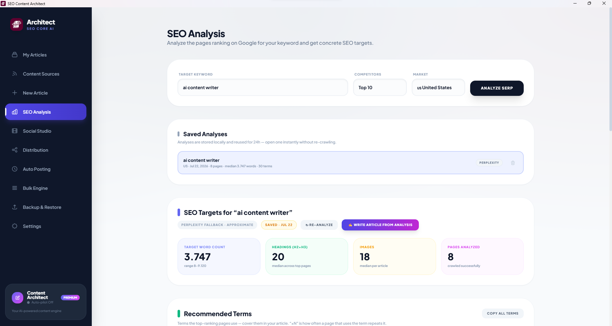
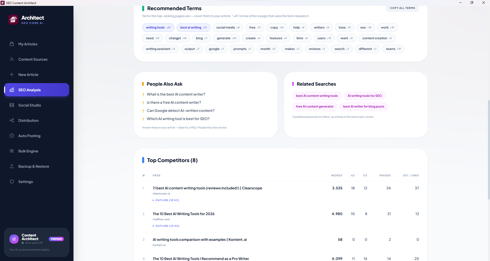

Most AI articles are written blind. You pick a keyword, generate 1,500 words, publish — and hope it's enough. But the pages already ranking on Google have quietly told you exactly what "enough" looks like: how long the article should be, which terms it must cover, which questions to answer, and how many headings and images the winners use. The new **SEO Analysis** page in [SEO Content Architect](https://content-architect.ns5.club) reads that signal for you. It crawls the current top-ranking pages for any keyword and turns them into concrete, copy-ready targets — then feeds those targets straight into article generation.

This guide explains what SEO Analysis does, the two ways to run it (a **Serper.dev** API key or **Perplexity**), and how to go from a keyword to a data-backed article in a couple of minutes.

## Why Analyze the SERP Before Writing?

Search engines rank the pages that best satisfy a query. So the top 10 results for your keyword are, collectively, a specification for what a complete answer looks like right now. Writing without reading them means guessing at:

- **Length** — is this a 900-word answer or a 3,700-word pillar?
- **Coverage** — which subtopics and terms does every ranking page include?
- **Intent** — is the SERP full of tutorials, listicles, or product pages?
- **Structure** — how many H2/H3 sections and images do the winners use?

SEO Analysis replaces those guesses with medians pulled from the actual results. Instead of "write a good article about *ai content writer*," you get "target ~3,700 words, 20 headings, 18 images, cover these 30 terms, and answer these 4 People Also Ask questions."

## Two Ways to Run It: Serper.dev or Perplexity

SEO Analysis is **BYOK** (bring your own key) — you plug in your own API key and pay the provider directly at cost. There are two supported data sources, and you only need one.

### Option 1 — Serper.dev (real Google SERP)

[Serper.dev](https://serper.dev) is a fast Google Search API. With a Serper key, SEO Analysis pulls the **actual top-ranking URLs** Google returns for your keyword and market, then crawls those pages to extract their terms, headings, word counts, images, and links. This is the most accurate mode because it's built on the real SERP — the same results a searcher sees. Serper offers a free tier to get started and low pay-as-you-go pricing after that, which is more than enough for blog-scale research.

### Option 2 — Perplexity (Sonar) fallback

If you don't have a Serper key but you already use **Perplexity** for [keyword research](how-to-do-keyword-research-with-ai-perplexity-sonar.md), SEO Analysis can run on Perplexity's Sonar models instead. Sonar queries the live web and reconstructs the competitive picture — terms, questions, and target ranges — without a dedicated SERP feed. Results are clearly labeled **"Perplexity fallback · approximate"** in the app, because they're an intelligent reconstruction rather than a raw crawl of Google's exact top 10. It's a great zero-extra-setup option if Perplexity is already in your stack.

Both keys live in **Settings**. Add either one, and the *Analyze SERP* button lights up.

### Which should you use?

| | Serper.dev | Perplexity (Sonar) |
|---|---|---|
| Data source | Real Google top 10 | Live-web reconstruction |
| Accuracy | Precise, page-level crawl | Approximate |
| Best for | Exact word/term/heading targets | Already-have-Perplexity users |
| Extra setup | New key (free tier) | None if you use Perplexity |

For serious, repeatable SEO work, use **Serper.dev** — real SERP data gives you real numbers. Perplexity is the convenient fallback when you just want fast, directional targets.

## Running an Analysis

The top of the SEO Analysis page has three inputs and one button:

1. **Target keyword** — the phrase you want to rank for (e.g. *ai content writer*).
2. **Competitors** — how many top results to analyze (e.g. Top 10).
3. **Market** — the country/locale to pull results for (e.g. US · United States), so you're benchmarking the SERP your audience actually sees.

Hit **Analyze SERP**. The app fetches the results, crawls the competitor pages, and assembles the report. Every analysis is also saved locally.

### Saved Analyses — no re-crawling

Analyses are **stored locally and reused for 24 hours**, so re-opening one is instant and doesn't spend another API call. Each saved entry shows the keyword, market, date, number of pages, median word count, term count, and which source produced it. Handy when you're drafting several articles around the same cluster over a few days.

## Reading the Report

### SEO Targets — your headline numbers

Four cards summarize what a competitive article looks like for this keyword:

- **Target word count** — the median across ranking pages, plus the full range (e.g. *3,747, range 8–9,120*). Aim for the median, not the maximum.
- **Headings (H2+H3)** — median heading count, a proxy for how deeply the topic is broken down.
- **Images** — median images per article.
- **Pages analyzed** — how many competitors were crawled successfully.

These are the numbers to write *toward* — enough to be comprehensive without padding.

### Recommended Terms — semantic coverage

A list of the terms the top pages actually use, each with a **×N** frequency showing how often a typical page repeats it (e.g. *writing tools ×20*, *best ai writing ×21*). These are your semantic-SEO checklist: cover them naturally and you signal the same topical depth Google is already rewarding. One click copies the whole list. (For why this matters, see semantic phrases in the [AI keyword research guide](how-to-do-keyword-research-with-ai-perplexity-sonar.md).)

### People Also Ask — instant FAQ

The questions Google surfaces for the keyword — e.g. *"Can Google detect AI-written content?"* These map 1:1 to an **FAQ / People Also Ask section**, which is prime featured-snippet territory. Answer them in your article and you cover intent the top pages may have missed.

### Related Searches — your next articles

Candidate keywords for follow-up posts in the same topic cluster (*best AI content writing tools*, *AI writing tools for SEO*). Use these to plan a cluster of interlinked articles rather than a single orphan page — the backbone of any [automated content strategy](complete-guide-automating-a-wordpress-blog-from-scratch.md).

### Top Competitors — the outline steal

A ranked table of the analyzed pages with their word count, H2/H3 counts, images, and external links. Each row expands to reveal that page's **outline** (e.g. *Outline (18 H2)*). Reading three or four competitor outlines side by side is the fastest way to spot the sections everyone covers — and the gap you can win with.

## From Analysis to Article in One Click

This is where the feature pays off. A **"Write Article from Analysis"** button sends the whole report — target word count, recommended terms, People Also Ask questions, and heading targets — straight into the article generator. The AI then writes *around* those targets instead of you pasting them in by hand. It's the same philosophy as [injecting keywords directly into generation](how-to-do-keyword-research-with-ai-perplexity-sonar.md): research shouldn't sit in a spreadsheet, it should shape the draft.

While you write or edit, a live **Content Score** panel grades your draft against those same targets — terms covered, word-count band, headings, PAA coverage, and images — with a checklist and concrete suggestions that update as you type. You know you've hit the brief before you publish, not weeks later when the rankings don't move.

And because everything runs on your own keys on your own machine, none of this carries a per-article SaaS markup — just the [BYOK cost of the API calls](real-cost-of-ai-generated-articles-byok-vs-saas.md).

## A Practical Workflow

1. Enter your keyword, pick a market, and **Analyze SERP** (Serper.dev for precision).
2. Note the **target word count** and skim **Top Competitor outlines** for common sections.
3. **Copy all terms** and glance at **People Also Ask** for your FAQ.
4. Click **Write Article from Analysis** to generate a draft built to the targets.
5. Edit with the **Content Score** panel open until the checklist is green.
6. Publish to WordPress — and remember Google rewards helpfulness, so [keep the content genuinely useful](how-to-write-seo-articles-with-ai-without-google-penalties.md), not just target-matched.

## FAQ

**Do I need both a Serper.dev and a Perplexity key?**
No — either one is enough. Serper.dev gives the most accurate, real-SERP analysis; Perplexity is the approximate fallback if that's the key you already have.

**Is SEO Analysis free?**
The feature is included in the app. You pay only your provider's API usage directly (Serper.dev has a free tier; Perplexity is pay-per-use and cheap at blog scale). There's no SaaS subscription on top.

**How accurate is the Perplexity fallback?**
It's a live-web reconstruction, clearly labeled "approximate." Great for fast, directional targets; use Serper.dev when you need exact word counts and term frequencies from the real top 10.

**Can I analyze non-US markets?**
Yes — set the Market field to the country/locale your audience searches from, so you benchmark the SERP they actually see.

**Why are analyses cached for 24 hours?**
SERPs don't change minute to minute, so caching lets you reopen a report instantly without spending another API call while you draft a cluster of related articles.

---

*SEO research, article generation, and WordPress publishing in one pipeline: [SEO Content Architect](https://content-architect.ns5.club) is a Windows desktop app with built-in SEO Analysis powered by your own Serper.dev or Perplexity key. [Try it free](https://apps.microsoft.com/detail/9NL3GZLPH01Z) — article generation is free forever.*
